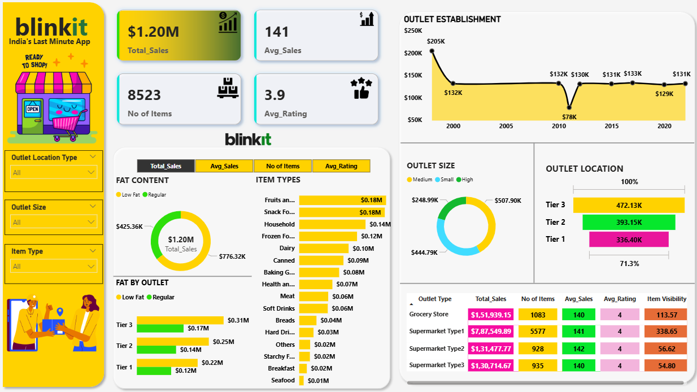
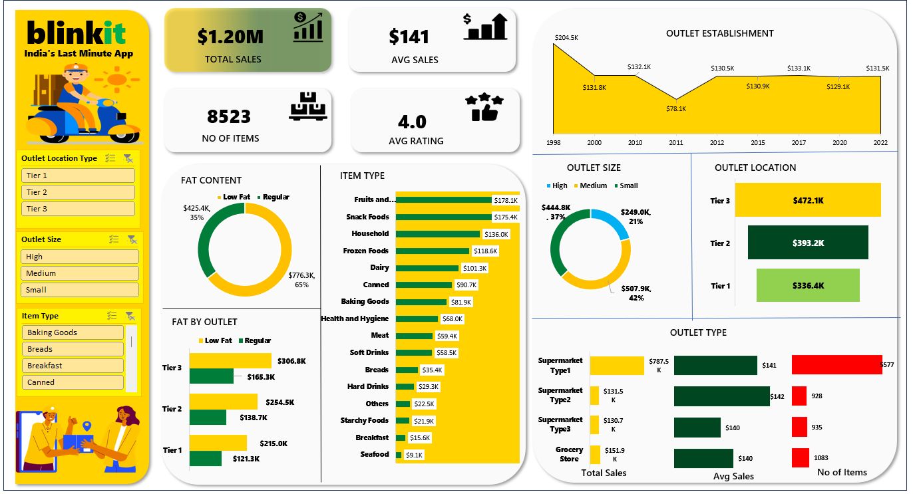

# E-Commerce-Sales-Analysis
*Analyzed 8.5K+ products across multiple outlets worth $1.2M in sales to identify top-performing categories, monitor outlet performance, and provide data-driven recommendations using SQL, Python, Excel, and interactive dashboards.*

---
## Project Overview
#### *This project focuses on analyzing Blinkit’s sales data to uncover.*
- Which item categories drive the most revenue.
- How outlet size & location impact sales.
- The role of fat content & customer ratings in purchasing behaviour.
- Trends in outlet establishment years and their performance.
- The analysis was performed using SQL queries, Python (Pandas, Matplotlib, Seaborn) for data cleaning & visualization, Excel pivot dashboards, and an interactive Power BI dashboard.

---
## Dataset Description
- Source: Blinkit Sales Analysis.
- Size: 8.5k+ products with $1.2M Sales.
### [blinkit_data.csv]https://github.com/abhi28408/E-Commerce-Sales-Analysis/blob/main/blinkit_data.csv
---
## Tech Stack
- SQL:  Data cleaning & KPI calculations.
- Python:  Data preprocessing & exploratory analysis.
- Excel:  Pivot table dashboard and Dashboard.
- Power BI:  Interactive visualization & reporting.

---
## Key KPIs
- Total Sales: $1.20M
- Average Sales per Item: $141
- Average Rating: 3.9 ⭐
- Total Items Sold: 8,523

---
## Methodology
### Data Source:
Blinkit sales dataset (8,523 products, $1.20M sales).
### Data Cleaning:
Performed using SQL & Python (Pandas) to remove inconsistencies, handle missing values, and standardize formats.
### Exploratory Data Analysis (EDA):
Conducted in Python using Matplotlib & Seaborn for trend visualization.
### Dashboarding:
Excel Pivot Dashboard for quick KPI monitoring
Power BI Dashboard for interactive and dynamic exploration

---
## Dashboard Snapshots
🔹 Power BI Dashboard

🔹 Excel Dashboard

---
## Insights 
- Item Categories: Fruits & snacks are top contributors, while categories like bread and health items generate minimal revenue.
- Outlet Size: Medium-sized outlets perform the best with $507.9K sales, while small outlets lag.
- Outlet Location: Tier 3 outlets dominate with $472K sales, compared to Tier 1 outlets at $336K.
- Fat Content: Regular products contribute 65%+ of sales, showing customer preference for non-dietary variants.
- Time Trends: Sales dipped in 2010 ($78K) but recovered steadily in later years.
  
---
## Recommendations
- Focus marketing on Tier 3 & Medium outlets where sales are strongest.
- Increase visibility of Fruits, Snacks, and Household categories.
- Introduce discounts & loyalty programs for low-performing outlets.
- Improve product visibility for low-fat & niche categories to balance customer demand.
---
## Conclusion
- This analysis highlights how Blinkit can strategically expand Tier 3 outlets, optimize product offerings, and focus on high-demand categories to increase revenue. Using SQL, Python, Excel, and Power BI, we successfully developed a data-driven framework that enables better decision-making and long-term business growth.  
